# SSA ASOS 2023
## Информация и решение проблем
### Просмотр глав в методичке
Чтобы увидеть отдельную панель с оглавлением ключевых блоков можно нажать эту кнопку

### Топология  

### Пользователи
- Для серверных машин

| Пользователь     | Пароль    |
|------------------|-----------|
| Administrator    | P@ssw0rd  |

- Для клиентских машин

| Пользователь     | Пароль    |
|------------------|-----------|
| User1            | P@ssw0rd  |

### Не работает Ctrl+Alt+Delete
Попробуйте Ctrl+Alt+End
### Рекомендации
* В процессе настройки читайте все информационные блоки текста, это полезно и иногда может подсказать решение если что-либо не сработало
## Таблицы
### Таблица 1
| Имя компьютера | Имя домена  | IP-адреса                              |
|----------------|-------------|----------------------------------------|
| DC-IZ          |             | 172.19.0.1/24                          |
| CLIENT-IZ      |             | DHCP                                   |
| IIS-IZ         | Izhevsk.ru  | 172.19.0.3/24,                         |
| EDGE-IZ        |             | 172.19.0.250/24, 200.100.50.101/24     |
|----------------|-------------|----------------------------------------|
| DC-M           |             | 172.16.0.1/24                          |
| FILES-M        |             | 172.16.0.2/24                          |
| SUBCA-M        | Moscow.ru   | 172.16.0.4/24                          |
| EDGE-M         |             | 172.16.0.250/24, 200.100.50.100/24     |
| CLIENT-M       |             | DHCP                                   |
|----------------|-------------|----------------------------------------|
| ROOTCA-M       | None        | 172.16.0.3/24                          |
### Таблица 2
Внимание, в pdf файле задания имена в таблице неправильные, здесь она отредактирована
| Ресурс          | Расположение                     | Доступ на чтение     | Доступ на запись    |
|-----------------|----------------------------------|----------------------|---------------------|
| Budget          |                                  | Project_Budget-R          | Project_Budget-W         |
| Intranet        | FILES-M—D:\shares\projects       | Project_Intranet-R        | Project_Intranet-W       |
| Logistics       |                                  | Project_Logistics-R       | Project_Logistics-W      |
## Базовая настройка
- Установим операционные системы, настроим имена машин, их ip адреса в соответствии с таблицей 1, DNS сервера для них и разрешим ICMP только для **CLIENT-IZ**, **EDGE-IZ**, **DC-M**, **FILES-M**, **SUBCA-M**, **EDGE-M**, **CLIENT-M**, **ROOTCA-M**

- Важно, шлюзы (Default Gateway) отличаются для разных сегментов сети, для каждого сегмента сети шлюзом является адрес интерфейса машин с именем **EDGE**, который смотрит внутрь сети
- На машинах с именем **EDGE** шлюз указывать не нужно, так же интерфейсы на них имеют следующее соответствие:
- Здесь показаны примеры и пояснения к настройке, все остальные машины настроить по аналогии

| В топологии | GUI Interface | CLI Interface Index |
|-------------|---------------|---------------------|
| e0          | Instance 0    | 1             	  |
| e1          | Instance 0 2  | 2             	  |

- Для машин с именем **Client** не нужно настраивать адреса и DNS, они будут получать их когда мы настроим DHCP Server

Для серверных машин с графикой:


Подождать открытия Server Manager


Перезагружаемся, снова доходим до пункта Local Server


Включим ICMP in


Для серверных машин без графики

Если терминал не отзывается на нажатие Ctrl+Alt+Del или Ctrl+Alt+End


То закрыть окошко на крестик, и нажать Ctrl+Alt+Del или Ctrl+Alt+End


Вводим
```
sconfig
```


Вводим
```
sconfig
```


Разрешим ICMP in

Вводим
```
sconfig
```
Далее вводим попорядку
```
4
3
```


Настройка имени компьютера для машин **CLIENT**


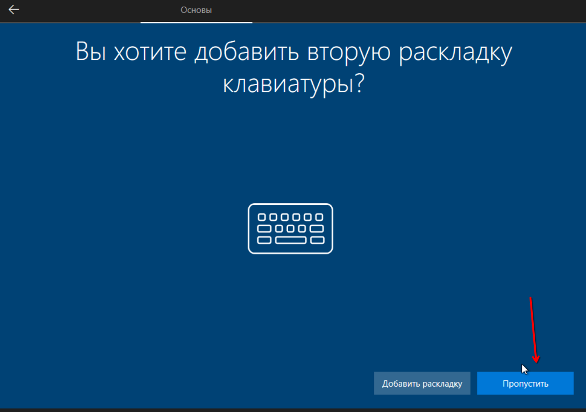


Здесь можно вписать любой текст, для быстрого выбора вопросов без открытия списка используйте колёсико мыши, повторяем трижды


Ждём перезагрузку

Настроим имя компьютера


Далее нажимаем "Закрыть" и нажимаем "Перезагрузить сейчас"

Включим ICMP in


Настроить по аналогии с тем, как настраивали для серверных машин с графикой

Проверим работу ICMP, пингуя те машины на которых разрешили его


Запретим использование «спящего режима» на **CLIENT-M**, для **CLIENT-IZ** по аналогии


## Поднятие домена
Пример для **DC-M**, для **DC-IZ** по аналогии


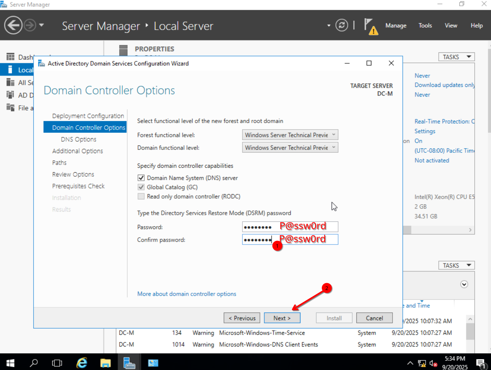


Сервер автоматически перезагрузится

Введём машины в домен в соответствии с таблицей 1
Для серверных машин с графикой

Вводим логин и пароль учетной записи администратора домена

Успешный ввод машины в домен выглядит так


Для серверных машин без графики
Вводим
```
sconfig
```


Клиентские машины в домен введём после настройки DHCP 

## Установка DHCP
На **DC-M**, на **DC-IZ** настроить DHCP по аналогии, но без failover

Мы уже знаем как дойти до вкладки "Select server roles", поэтому продолжим инструкцию оттуда


### Ввод клиентских машин в домен
На **CLIENT-M**

Чтобы удостовериться, что клиент получил адрес от DHCP сервера перед тем как ввести его в домен, вводим в cmd
```
ipconfig
```

Если клиент не получил адрес, вводим
```
ipconfig /renew
```
Вводим клиента в домен

Мы уже знаем как перейти в "Свойства системы", продолжим оттуда


### Настройка DHCP failover
Установим DHCP на FILES-M

Заходим на DC-M
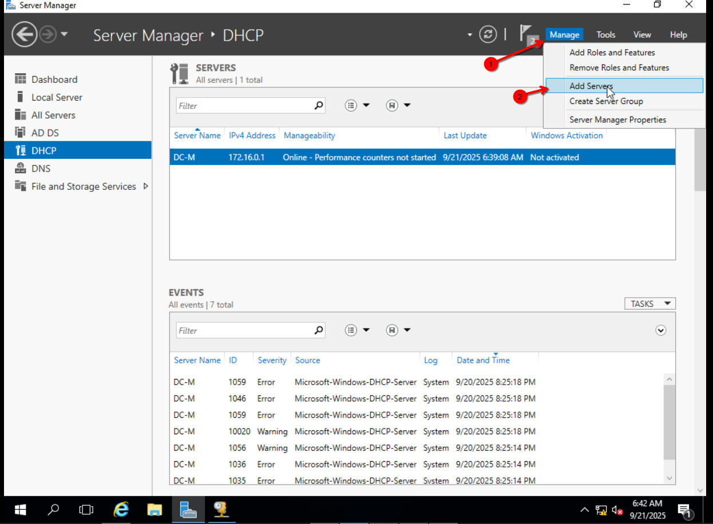

Теперь переходим на страницу "Select Destination Server"


## DNS и AD
На **DC-M** 


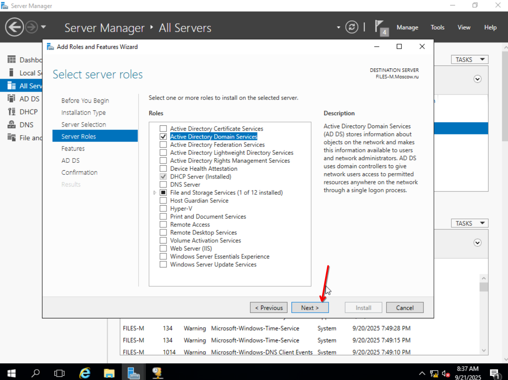


Настроим и создадим PTR зону, а так же её репликацию на FILES-M 

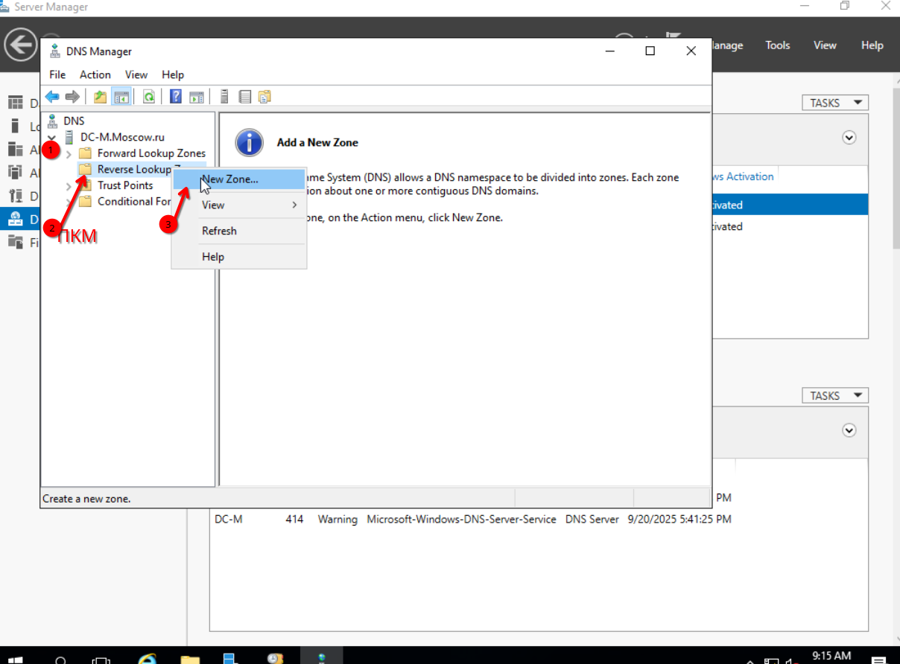


Операцию создания PTR записи повторить для всех записей типа "A", кроме записей для машин **EDGE**, в которых IP адрес находится в другой подсети
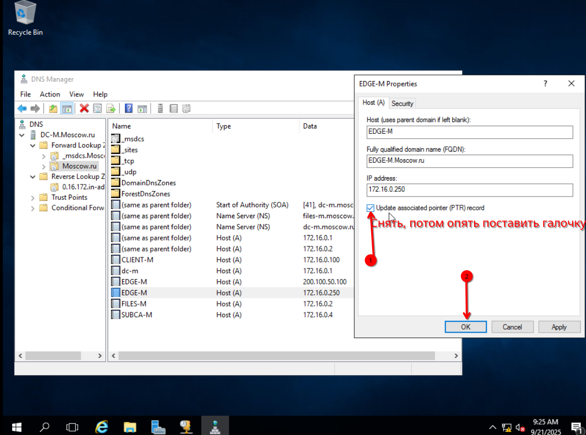
Проверим, что зоны DNS реплицировались на **FILES-M**


## USERGATE
Его не будет, т.к. на текущем стенде в поставляемом образе отсутствует установщик :(
## RRAS
На **DC-M**, по аналогии настроить на **DC-IZ**


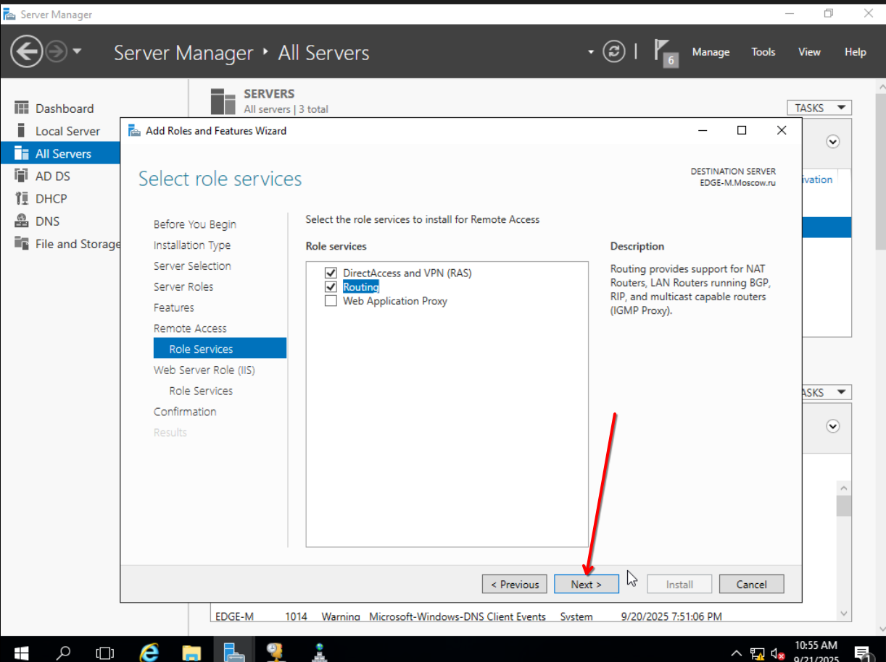


Далее пример настройки маршрутизации в сегменте Ижевска, по аналогии сделать в Москве
На **DC-IZ**


Теперь чтобы наши настройки точно применились, перезагрузим RRAS

Проверим, что между сетями есть связь, с **DC-M** пинганём **DC-IZ**


## Настройка трастов
Выполним задание
```
Настройка DC-M

Настройте одностороннее нетранзитивное доверие с доменом Izhevsk.ru – пользователи домена
Moscow.ru должны иметь доступ к ресурсам домена Izhevsk.ru, но не наоборот.
```
На **DC-M**
Добавим DNS сервер домена Izhevsk.ru на **DC-M**


Приступим к настройке трастов


 


Теперь подтвердим траст


Теперь проверим что на **DC-IZ** траст тоже подтвержден


Чтобы проверить, что односторонний траст был настроен, на **CLIENT-IZ** зайдем под пользователем Administrator в домене Moscow.ru

Если нас впустило, то всё сработало


Проверим противоположное на **CLIENT-M**, авторизация не должна сработать


## GPO
### Элементы доменной инфраструктуры
Выполним задание
```
Cоздайте подразделения: Experts, Competitors, Managers, Visitors, IT и Project;
```
Дополнительно создадим ```CompanyUsers, ClientPCs```


Создайте оставшиеся OU по аналогии

Выполним задание
```
В соответствующих подразделениях создайте доменные группы:
Experts, Competitors, Managers, Visitors,IT , Project_Budget-R, Project_Budget-W, Project_Intranet-R, Project_Intranet-W, Project_Logistics-R, Project_Logistics-W;
```


Создайте остальные доменные группы по аналогии

```
Создайте 3-4 пользователя(вся имеющаяся информация о пользователях должна быть внесена в Active Directory); поместите пользователей в
соответствующие подразделения и группы; все созданные учетные записи должны быть включены и доступны;
```
#### Информация о пользователях
| Полное имя       | Логин     | Должность           | Отдел      | Группы AD       | Email               | Телефон       | Пароль   |
|------------------|-----------|---------------------|------------|-----------------|---------------------|---------------|----------|
| Ivan Petrov      | petrov.i  | System Administrator | IT  | Experts, IT     | petrov.i@company.ru | +74951112288 | P@ssw0rd |
| Olga Sidorova    | sidorova.o| Guest               | External Relations | Visitors      | sidorova.o@company.ru | +74951112299 | P@ssw0rd |
| Dmitry Kovalev   | kovalev.d | Logistics Manager   | Logistics  | Logistics, Managers | kovalev.d@company.ru | +74951113300 | P@ssw0rd |


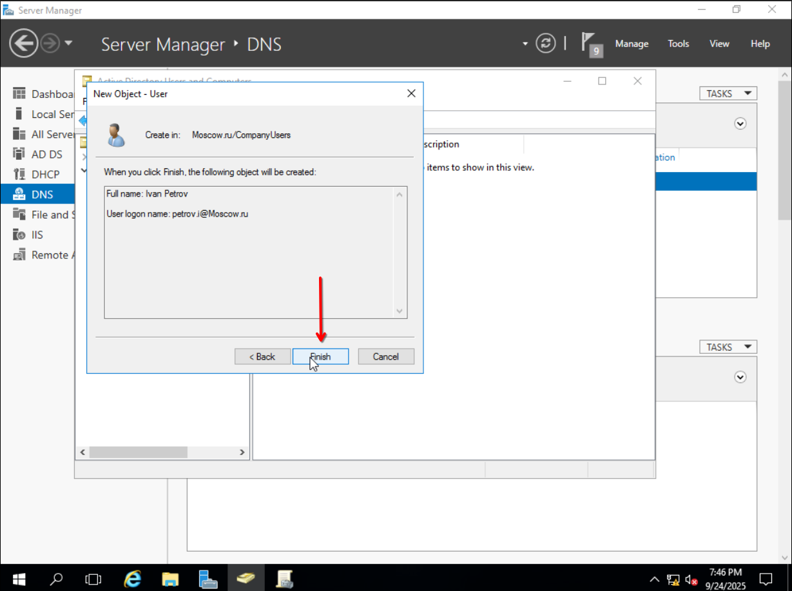


Остальных пользователей создать по аналогии

### Остальные задания GPO

На **DC-M**
Выполним задание

```
запретите анимацию при первом входе пользователей в систему на всех клиентских компьютерах
домена
```


Проверим отсутствие анимации на **CLIENT-M**, авторизировавшись на нём от имени администратора домена, но перед этим компьютер нужно перезагрузить для применения групповых политик


Если всё сработало, то во время входа будет надпись "Подготовка Windows" вместо стандартной анимации, начинающийся с текста "Привет!"

Выполним задание 
```
Члены группы IT должны быть членами группы локальных администраторов на всех клиентских компьютерах домена;
```


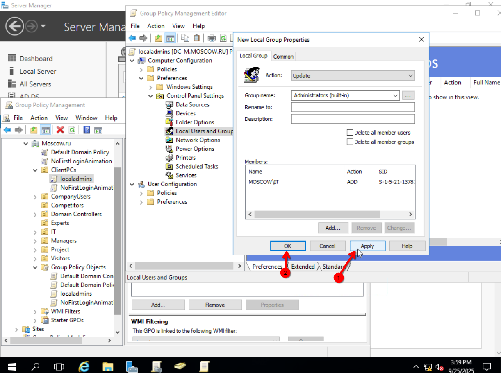

Проверим работу этой политики
Заходим на **CLIENT-M** под юзером `petrov.i`
Обновим политики


Выполним задание
```
Запретите изменение экранной заставки и Корзину на рабочем столе для всех пользователей домена, кроме членов группы локальных администраторов клиентских компьютеров
```
На **DC-M** создадим политику для всего домена с именем wallpapers_and_bin и настроим её


Теперь уберём корзину с рабочего стола


Так же отключим применение для группы IT


Перейдём на **CLIENT-M**

Перезагрузим его

Зайдём под пользователем `sidorova.o`

Если на рабочем столе нет корзины, значит политика применилась


#### RAID-5 на FILES-M
```
Из трех имеющихся жестких дисков создайте RAID-5 массив; назначьте ему букву D:\.
```
Перейдём на **FILES-M**


Перед тем как сделать диск динамическим, нужно прописать
```
attribute clear disk readonly
```

Иначе будет следующая ошибка: 


После очистки атрибута `readonly` всё отрабатывает корректно


Эти действия необходимо проделать так же с 2 и 3 дисками, должно получиться следующее


После этого, создадим рейд массив


Буква D уже занята, поэтому сначала удалим её а потом присвоим нашему рейд массиву


Отформатируем раздел


Выполним задание
```
Для членов группы Experts настройте перенаправление папок my Documents и Desktop по адресу FILES-M→d:\shared\redirected
```
На **FILES-M** создадим папку
```
mkdir D:\shared\redirected
```

Теперь на **DC-M** создадим шару


Создадим групповую политику в корне домена под названием `RedirectExperts` и отредактируем её


По аналогии сделаем с `Documents`

Зайдём на **CLIENT-M** под пользователем `ivan.p` и обновим политики в cmd
```
gpupdate /force
```


Снова логинимся под пользователем `ivan.p`
Проверим, где теперь находятся файлы на рабочем столе


Выполним задание из пункта "Элементы доменной инфраструктуры" 
```
Для каждого пользователя создайте автоматически подключаемую в качестве диска U:\ домашнюю папку по адресу FILES-M→d:\shares\users.
```
На **DC-M**
Создадим нужные папки на **FILES-M**


В итоге должен получиться следующий путь

Так же внутри папки `users` создадим папки с системным именем пользователей в качестве названия
```
kovalev.d
petrov.i
sidorova.o
```
Для каждой из них настроим доступ конкретному пользователю


Настроим сетевую шару выбирая путь `d:\shares\users` 


Создадим GPO для автоподключения диска в корне домена под именем "DiskU" и настроим его

Теперь зайдём на **CLIENT-M** под чьим-либо аккаунтом и проверим что диск подключен, так же попробуем создать файл


## Общие папки
```
Cоздайте общие папки для подразделений (Competitors, Experts and Managers) по адресу FILES-M→d:\shares\departments;
Обеспечьте привязку общей папки подразделения к соответствующей группе в качестве диска G:\;
```
Создадим папку на **FILES-M** вследующем расположении


Пошарим эту папку по сети


Создадим папки и выдадим права нужным группам


Оставшимся папкам настроим права по аналогии

Создадим GPO в корне домена и назовём его "DiskG", а так же настроим


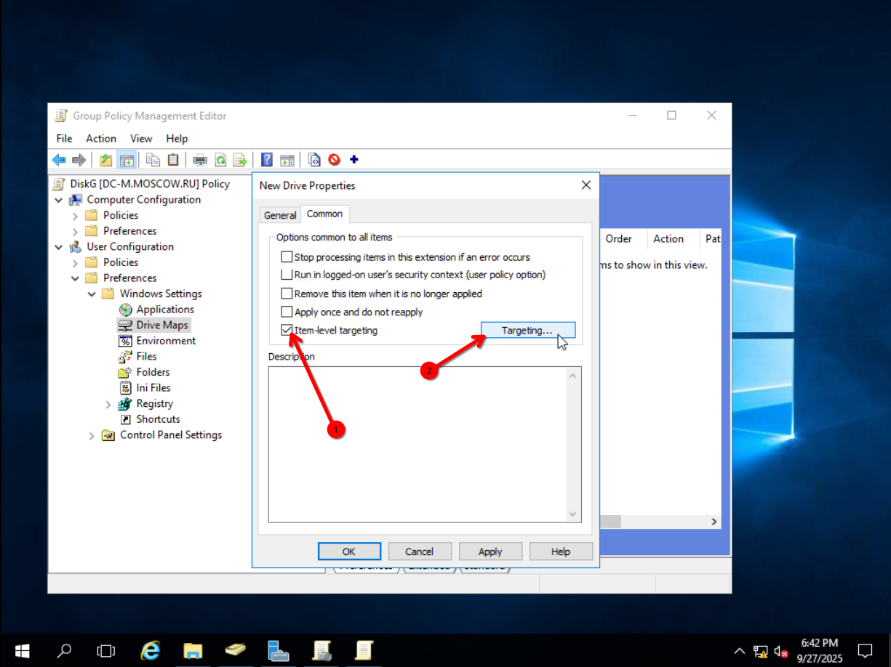

Тут представлена настройка для "Competitors", для остальных настройте по аналогии


В итоге должно получиться так


Перейдём на **CLIENT-M** и обновим политики
```
gpupdate /force
```


Проверим работу политики, залогинимся под юзером `petrov.i`, откроем диск и создадим файл


Выполним задания
```
Создайте общую папку проектов по адресу FILES-M→d:\shares\projects;
В папке d:\shares\projects создайте следующие папки: Budget, Intranet, Logistics; 
Настройте разрешения этих папок в соответствии с таблицей 2;
```


Пример для `Budget`, оставшиеся настроить по аналогии


Расшарим папку по сети


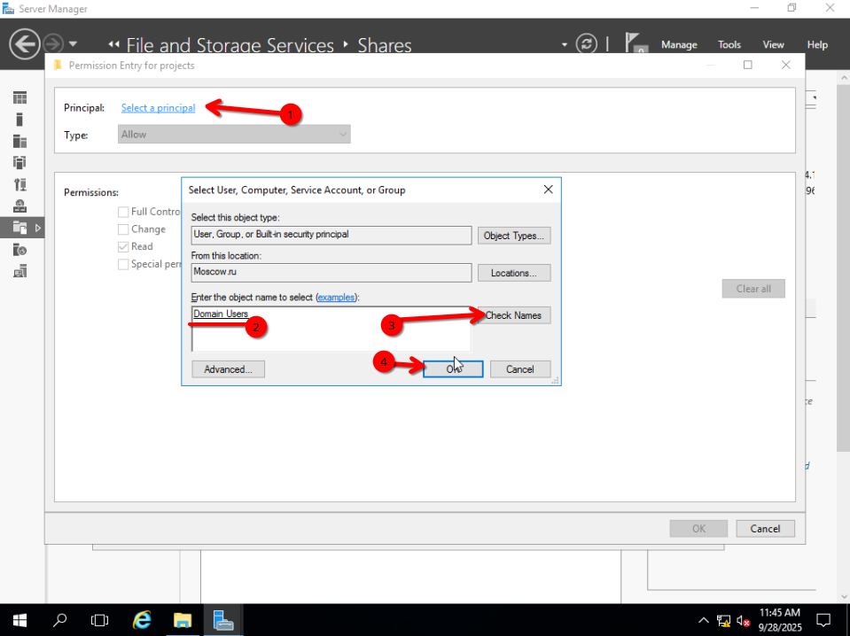


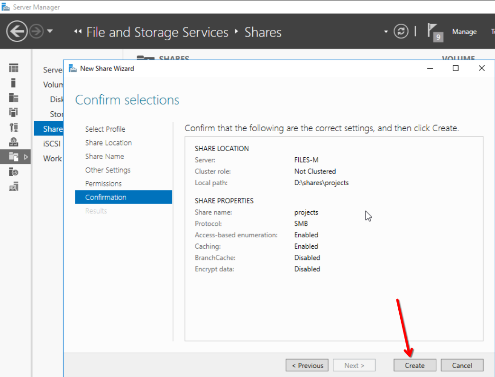


Создадим в корне домена GPO с именем "DiskP", а так же настроим эту политику


Переходим на **CLIENT-M** и обновляем политики
```
gpupdate /force
```


Логинимся под пользователем `kovalev.d` и проверяем, что у нас показывается на диске P:
Пользователь может видеть только папку, к которой у него есть доступ

Проверим права записи, создав файл


## Квоты/Файловые экраны
На **DC-M**
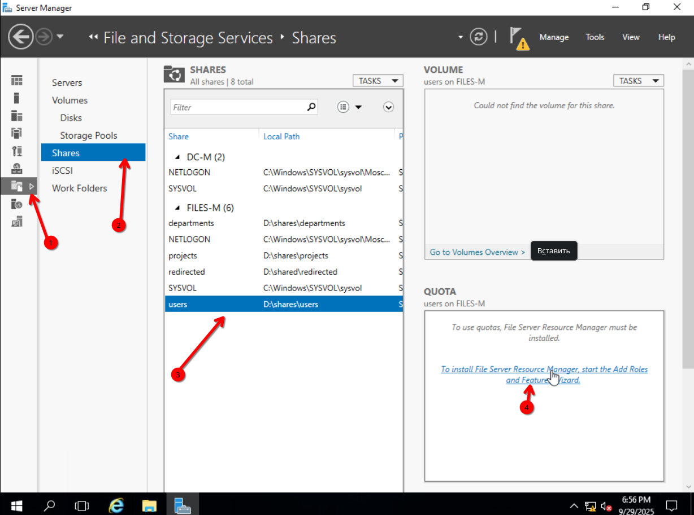


Зайдём на **CLIENT-M** и проверим работу квоты
- если уже были залогинены под юзером то нужно перезайти
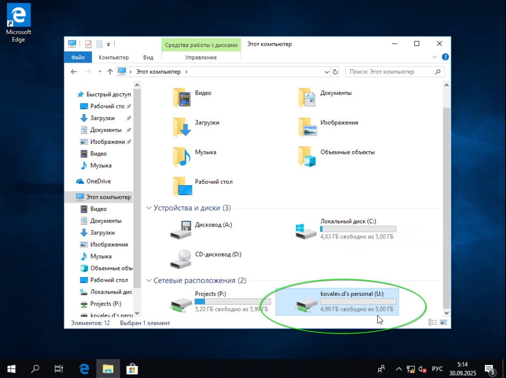

Выполним задание
```
Запретите хранение в домашних папках пользователей файлов с расширениями .cmd и .exe; учтите, что файлы остальных типов пользователи вправе хранить в домашних папках.
```
На **FILES-M** необходимо предварительно отключить файрвол на время настройки
```
netsh fi set opmode DISABLE
```
Продолжим настройку с **DC-M**


Проверим настройки на **CLIENT-M**

Создадим на рабочем столе файл с расширением .exe и попробуем переместить его в сетевую папку


