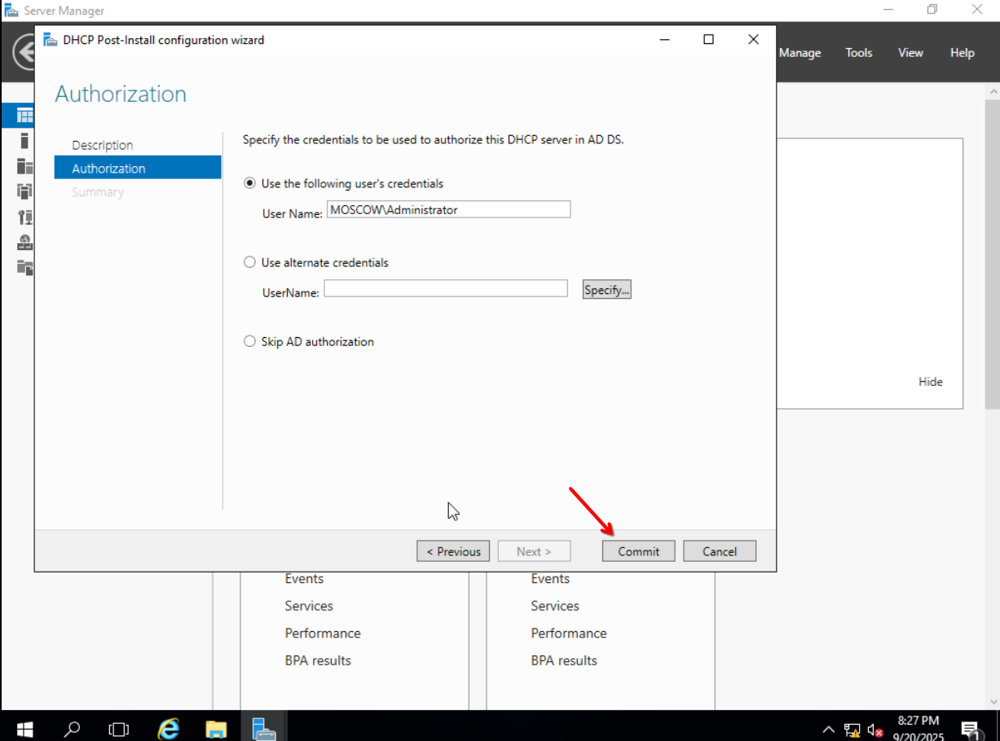
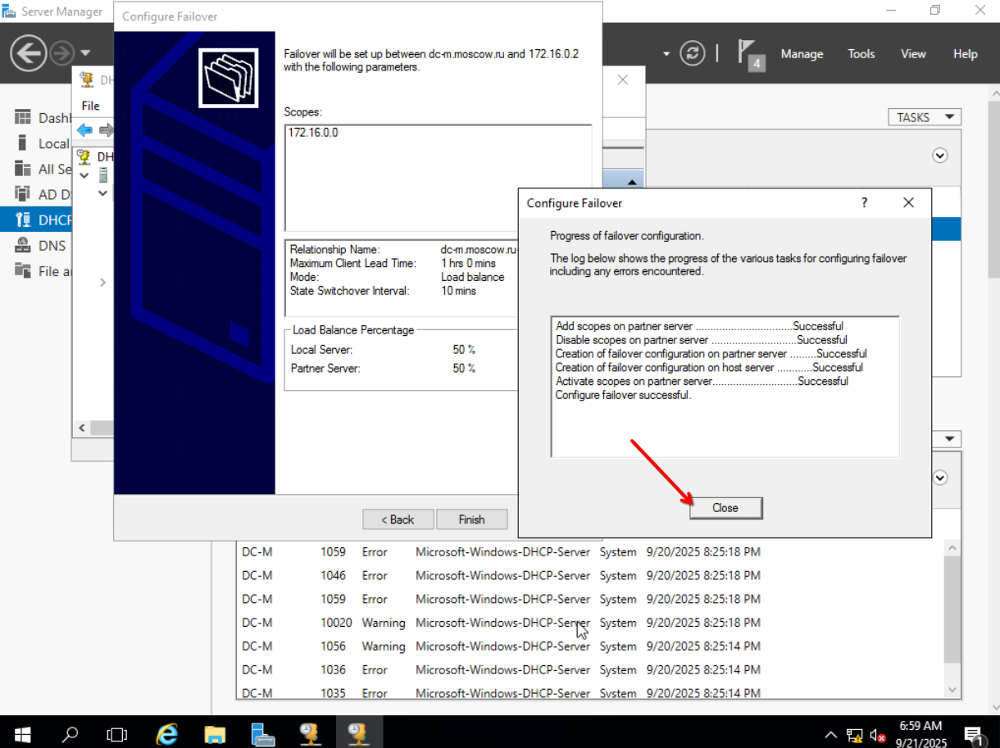
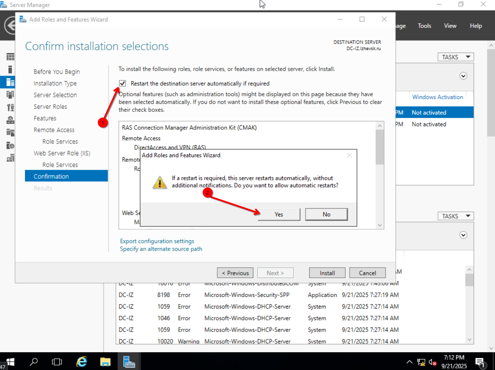

# SSA ASOS 2023
## Информация и решение проблем
### Топология  

### Пользователи
- Для серверных машин

| Пользователь     | Пароль    |
|------------------|-----------|
| Administrator    | P@ssw0rd  |

- Для клиентских машин

| Пользователь     | Пароль    |
|------------------|-----------|
| User1            | P@ssw0rd  |

### Не работает Ctrl+Alt+Delete
Попробуйте Ctrl+Alt+End

## Таблицы
### Таблица 1
| Имя компьютера | Имя домена  | IP-адреса                              |
|----------------|-------------|----------------------------------------|
| DC-IZ          |             | 172.19.0.1/24                          |
| CLIENT-IZ      |             | DHCP                                   |
| IIS-IZ         | Izhevsk.ru  | 172.19.0.3/24,                         |
| EDGE-IZ        |             | 172.19.0.250/24, 200.100.50.101/24     |
|----------------|-------------|----------------------------------------|
| DC-M           |             | 172.16.0.1/24                          |
| FILES-M        |             | 172.16.0.2/24                          |
| SUBCA-M        | Moscow.ru   | 172.16.0.4/24                          |
| EDGE-M         |             | 172.16.0.250/24, 200.100.50.100/24     |
| CLIENT-M       |             | DHCP                                   |
|----------------|-------------|----------------------------------------|
| ROOTCA-M       | None        | 172.16.0.3/24                          |
### Таблица 2
| Ресурс          | Расположение                     | Доступ на чтение     | Доступ на запись    |
|-----------------|----------------------------------|----------------------|---------------------|
| Budget          |                                  | RU-Budget-R          | RU-Budget-W         |
| Intranet        | FILES-M—D:\shares\projects       | RU-Intranet-R        | RU-Intranet-W       |
| Logistics       |                                  | RU-Logistics-R       | RU-Logistics-W      |
## Базовая настройка
- Установим операционные системы, настроим имена машин, их ip адреса в соответствии с таблицей 1, DNS сервера для них и разрешим ICMP только для **CLIENT-IZ**, **EDGE-IZ**, **DC-M**, **FILES-M**, **SUBCA-M**, **EDGE-M**, **CLIENT-M**, **ROOTCA-M**

- Важно, шлюзы (Default Gateway) отличаются для разных сегментов сети, для каждого сегмента сети шлюзом является адрес интерфейса машин с именем **EDGE**, который смотрит внутрь сети
- На машинах с именем **EDGE** шлюз указывать не нужно, так же интерфейсы на них имеют следующее соответствие:
- Здесь показаны примеры и пояснения к настройке, все остальные машины настроить по аналогии

| В топологии | GUI Interface | CLI Interface Index |
|-------------|---------------|---------------------|
| e0          | Instance 0    | 1             	  |
| e1          | Instance 0 2  | 2             	  |

- Для машин с именем **Client** не нужно настраивать адреса и DNS, они будут получать их когда мы настроим DHCP Server

Для серверных машин с графикой:


Подождать открытия Server Manager


Перезагружаемся, снова доходим до пункта Local Server


Включим ICMP in


Для серверных машин без графики

Если терминал не отзывается на нажатие Ctrl+Alt+Del или Ctrl+Alt+End


То закрыть окошко на крестик, и нажать Ctrl+Alt+Del или Ctrl+Alt+End


Вводим
```
sconfig
```


Вводим
```
sconfig
```


Разрешим ICMP in

Вводим
```
sconfig
```
Далее вводим попорядку
```
4
3
```


Настройка имени компьютера для машин **CLIENT**


Здесь можно вписать любой текст, для быстрого выбора вопросов без открытия списка используйте колёсико мыши, повторяем трижды


Ждём перезагрузку

Настроим имя компьютера


Далее нажимаем "Закрыть" и нажимаем "Перезагрузить сейчас"

Включим ICMP in


Настроить по аналогии с тем, как настраивали для серверных машин с графикой

Проверим работу ICMP, пингуя те машины на которых разрешили его


## Поднятие домена
Пример для **DC-M**, для **DC-IZ** по аналогии


Сервер автоматически перезагрузится

Введём машины в домен в соответствии с таблицей 1
Для серверных машин с графикой

Вводим логин и пароль учетной записи администратора домена

Успешный ввод машины в домен выглядит так


Для серверных машин без графики
Вводим
```
sconfig
```


Клиентские машины в домен введём после настройки DHCP 

## Установка DHCP
На **DC-M**, на **DC-IZ** настроить DHCP по аналогии, но без failover

Мы уже знаем как дойти до вкладки "Select server roles", поэтому продолжим инструкцию оттуда





### Ввод клиентских машин в домен
На **CLIENT-M**

Чтобы удостовериться, что клиент получил адрес от DHCP сервера перед тем как ввести его в домен, вводим в cmd
```
ipconfig
```

Если клиент не получил адрес, вводим
```
ipconfig /renew
```
Вводим клиента в домен

Мы уже знаем как перейти в "Свойства системы", продолжим оттуда


### Настройка DHCP failover
Установим DHCP на FILES-M

Заходим на DC-M


Теперь переходим на страницу "Select Destination Server"




## DNS и AD
На **DC-M** 


Настроим и создадим PTR зону, а так же её репликацию на FILES-M 


Операцию создания PTR записи повторить для всех записей типа "A", кроме записей для машин **EDGE**, в которых IP адрес находится в другой подсети

Проверим, что зоны DNS реплицировались на **FILES-M**


## USERGATE
Его не будет, т.к. на текущем стенде в поставляемом образе отсутствует установщик :(
## RRAS
На **DC-M**, по аналогии настроить на **DC-IZ**


Далее пример настройки маршрутизации в сегменте Ижевска, по аналогии сделать в Москве
На **DC-IZ**





Теперь чтобы наши настройки точно применились, перезагрузим RRAS

